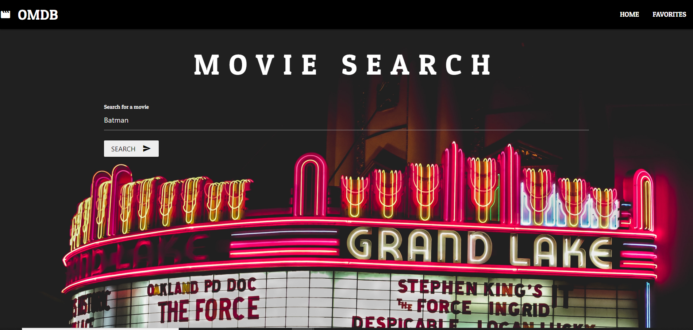
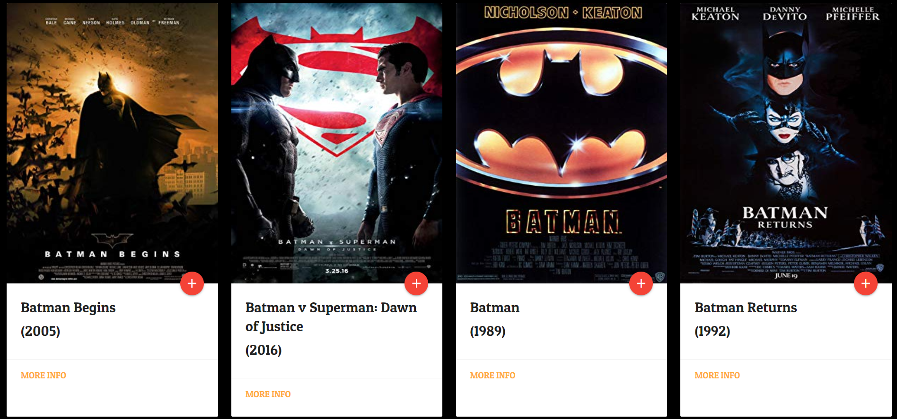

# OMDB-Search :mag:
A fullstack application that implements the OMDB API where users can search for movies.

## :clipboard: Table of contents
- [&#x1f527; Technologies & Tools](#-key-technology--tools)
- [:framed_picture: Images](#framed_picture-images)

## &#x1f527; Key Technology & Tools
- HTML
- CSS
- Materialize
- JavaScript
  - Handlebars.js
  - Node.js
  - Express.js
  - Passport.js
  - Sequalize
- API
  - OMDB

## :framed_picture: Images
  
  
  

